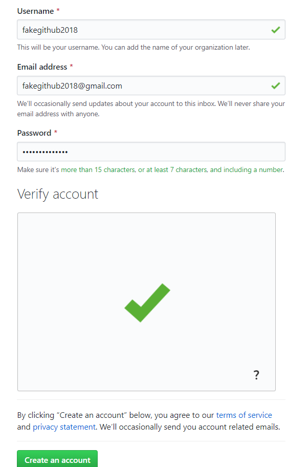

# GitHub Tutorial

_by Wilson Zhang_  

##### Note: This tutorial is mainly for people who uses Cloud 9 IDE 

---
## Git vs. GitHub
**Git:** a version control that help keep "snapshots" of code
* The tool that you could use
* ***We do not need Github for Git to work***  

**GitHub:** stores your code in a cloud (a network of servers that is hosted on the internet)
* the service for project that uses Git
* ***We need Git to use Github***

Git is only a tool for the users to use when programming while github is a cloud that allows the users to store their code.

---
## Initial Setup
#### **Create a Github account**

1. First go into the home Github website [(click here for the link)](https://www.github.com)
2. Then click sign up near the top right
3. Then please enter a username that you will use (use your hstat email but without @hstat.org)
4. Then type in your email that you want to use (hstat email)
5. Make sure to verify account and then click "Create an account"
6. Then choose your plan (students please choose FREE) and click "Continue"
    * The Checkboxes is optional

7. Next answer the questions and press Submit
8. When it is loaded it is COMPLETED!

#### How to link Cloud 9 and Github with SSH Key
1. Go to the Cloud 9 dashboard and click the gear icon on the top right
2. Then click on the "SSH Keys" on the left side
3. You should see two big block of text(if not please scroll down). Copy the **SECOND** block of text
4. Open [github.com](github.com)
5. Click on your profile picture, on the top right, and click "settings"
6. Click on thee "SSH and GPG keys" on the left side.
7. Then click on "New SSH Key"
8. Write a title for the SSH key(i.e. cloud9)
9. Then under the "key" paste in the key that you copy from cloud 9
10. Click on "Add SSH key"
11. Now go back to cloud 9 dashboard and open your workspace
12. In the terminal type in: `ssh -T git@github.com`. If everything went well, then it should tell you "Hi (your username)! You've successfully authenticated, but GitHub does not provide shell access."

---
## Repository Setup
#### On the Cloud 9
**Please refer to *Workflow & Commands* if you need the definitions and usage of some of the command**  

Use `mkdir (filename)` to create a directory
When you first create a directory there are important steps to take before you can save your code:  
1. You should always cd (move) into the directory
2. Use `git init` to allow git to start saving your changes
3. After you have made some changes to a file you can do `git add`
    * You can create a file by using the command `touch (filename)` 
4. Finally, right after `git add` you can do `git commit -m ""` to save you changes
5. Every once in a while, you should have to do `git push`(You have to do `git push -u origin master` first) to push your changes to github

#### New Repository on Github
When you are sign in you should see your profile picture on the top right
1. Click the profile picture and click "your repository"
2. Next click the Green Button on the right side that says "NEW" 
3. Type in a name for your repository. Name your repository the **SAME** as you have name your directory in your IDE(or local)
4. You may leave the other settings alone. If you wish, you may change it.
5. On the top, you may see the setting to switch between HTTPS and SSH. Please switch to SSH if you are in HTTPS.

---
## Workflow & Commands
#### Important Commands
`git status`
* The best tool to solve any (*most*) problems since it provide hints to fix a problem
* It is used to see the state of your file(s)  

`git init`
* To **initilize** the directory and set up the tool for git

`git add (filename)`
* It is a command to add a file to the "staging area" which lets the computer know your change
* Gets the files ready for a commit(save)
* You may use `git add .` to add the new and modified files but not the deleted one(and also the renamed ones)
* You may also use `git add --all` to add all the files

`git commit -m " "`
* A command to save your changes 
* `-m " "` allows you to add your own message to your commit(save) you put your message in between ""
* *It needs your file to be add to the "staging area"*

`git remote add origin URL`: Creates the "bridge" that connects the local repository on Cloud 9 to the remote repository on Github
* remote - Sets up the connection between the local repository and the remote repository.
* add -** Adds the remote repository.
* origin - The nickname for the remote repository.
* URL - The URL(address) to the remote repository. It should be in SSH(but it could also be HTTPS)

`git push -u origin master`
* `git push` - is to send your commits to github
* `-u` - means upstream, it saves which github repository it is sending to so next time you are pushing your saves you can just write `git push` and do not need the rest
    * *without it you have to type the whole `git push -u origin master` again*
* `origin` - the remote that we are pushing to
* `master` - the "main" branch that we are pushing to

---
## Rolling Back Changes
* You can use `git status` to see what you can do to undo something you have done(only works for edits and add)

#### Undo Edits
The command to use: `git checkout -- <filename>`
* This is to discard changes in the file that you have not commited yet. 

#### Undo Add
The command to use: `git reset HEAD <filename>`
* This unstages the file change and is ready for any changes that are going to be made(After you are done do `git add` again so you can save your changes)

#### Undo Commits
There are three ways: 
* `git reset --hard HEAD~1`
* `git reset HEAD~1`
* `git reset --soft HEAD~1`

`git reset --hard HEAD~1`
* To completely delete the commit and never see it again which can be dangerous
* If you have done this and want it back, there is a way to save your file
    * do git reflog to see a list of commit SHAs
    * `git checkout -b newBranchName shaCommitYouDestroyed`
    * Commits would usually stay for 90 days so you can save your commits that you don't meant to completely destroy

`git reset HEAD~1`
* To undo the current commit and undo the add
* This allows you to go back to the previous commit but keeps your changes
* You have to do `git add` and `git commit` again

`git rest --soft HEAD~1`
* To only undo the current commit
* This allows you to go back to where you just did the most recent `git add`
* You can do `git commit` and you will be jsut doing the same commit that you just had
 
#### Undo Push
The command to use: `git revert <SHA code>`
* It doesn't have to be the latest commit, as long as you use the correct SHA code it should revert to that commit
* Reverting the commit is just creating a new commit that undos and replaces all the "bad" commits
* This completely changes the commit history and delete the commit even from the remote
* This is not recommend, especially when you are collaborating with others

## Error-Handling
There are time where mistakes can happen by accident. These are some of the mistakes and how to handle them.

#### git init in the wrong place
Let just say that you accidently git init in your workspace(which you should **NOT** do) and you want to fix that. 
How can you tell that you git init you directory? (2 ways)
1. If you do `ls -a` and you see a folder called: .git then your directory is initilized
2. If you see (master) next to your file path git init creates a file called .git(it is hidden)  
.png)  
To uninitalize your repository you do:
1. Go to where you accidently git init your directory
2. Delete it by doing `rm -rf .git`

#### How to remove a repository(local)
If you want to completely remove a repository on Cloud 9 you would have to use:  
* `rm -rf (filename)` - use this command careful since it removes the repository **AND** the files inside. 
* `rmdir (filename)` - use this command to remove only empty directory 

#### How to remove a repository(remote)
If you want to completely remove a repository on Github you would have to:

## Collaboration
#### Fork & Clone
There are times when you want to change a project that is from another person, to do this you must fork and then clone it into your local to change it.  
**How to fork:**
1. Go to Github and go onto the project that you want to make changes to
2. Click the "fork" button on the top on the right side of the title  

3. Wait until Github is done forking the project when it is loaded you should see your username near with the project name that your forked

**How to clone**
When you finish the fork of the project you must clone it into your Cloud 9 to make any changes
1. Find the green "Clone or download" button near the right side and click on it
2. AFter you click on it you should see "Clone with_____"
    1. If it says HTTPS click on "Use SSH" to the right
    2. If it says SSH. You can leave it
3. Click on the clipboard next to the SSH to copy it (it should look something like this: (git@github.com:username123/nameofproject.git)
4. Go back to cloud 9 and type in your terminal `git clone` and paste in the SSH and then press ENTER
5. Now you should see a new repository that have the name of the project.

#### Pull and Pull Requests
`git pull` - takes all the change that is made on the remote repository on github to your local repository on Cloud 9

**Pull Requests** - You may want to give your changes of someone else's project to them which can be done by doing a pull request. However, the owner of the project can either accept or denied your changes. If accepted your changes will be put into the new repository but if you are denied then nothing on the repostiory would change.

**How to create a pull request**
1. Go to your repository that you have forked
2. Click on the "New pull requests" button
3. Click on the green button that says "Create pull request"

Now wait until the owners checks your changnes and either approve or denied it
